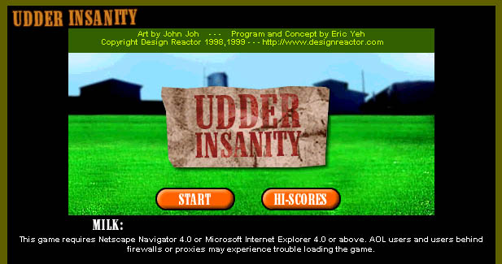
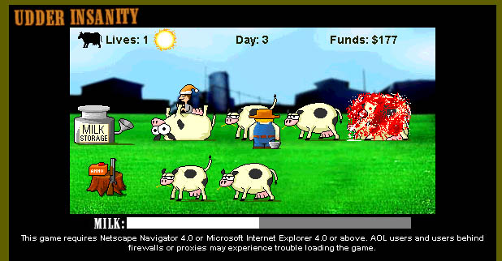
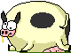
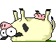

# Udder Insanity

This contains the source and media for the game Udder Insanity, a Java applet that was hosted on designreactor.com in the late 90s and early 00s.  The player controlled a dairy farmer who had to collect milk from his herd.  If a cow was left unmilked, she eventually would explode in a dramatic and completely biologically plausible fashion.  If the farmer over-milked a cow, the chafing on the cow's milk tubes would stress would cause the cow and cause it to explode (science).  Because stress is not enough, slackers (popular in the 90s) would try to sneak by and tip a cow.  The farmer's only recourse would be pull out his shotgun and fire a warning shot with both barrels, a societally approved solution clearly enough to deter any intruder.

The applet was written a long time ago, in a time when the code's author lacked anything resembling good coding and game development practices.  Outside of the lack of comments, the use of an ancient platform known to be a security liability, the game's timing was controlled by CPU speed.  Because of these challenges to getting the game ressurrected, we have put the code up "as-is" for now.

The game source and media are in the [game_source_assets](game_source_assets) directory.

## Credits
Media: John Joh
Code: Eric Yeh

## Development Notes

Udder started out as a clone of Tapper, that great arcade game of the 80s where the player controlled bartender had to heave mugs of "family friendly" beverages at thirsty patrons.  Making a pure copy is never fun, so we started out with the core game mechanic of having to manage a queue.  Stripped to "first principles," this is a game where the player has to move an avatar around multiple queues that fill up at different rates.  At each queue, the player can perform an action to relieve the queue, and if a queue overflows, the player loses a life.  The queues are arranged spatially and adjacencies are restricted, requiring the player to be strategic about where to move next.  This also requires the vital mechanic of penalizing the player takes action on an empty queue.  In Tapper, this would be heaving a mug down an empty counter.  In Udder, this was overmilking a cow.  Having a penalty for not paying attention is important, otherwise players can develop a degenerate strategy of performing a circuit through each queue while hitting the action button (not fun).

Because Udder had a collection mechanic, we saw an opportunity for players to engage in a "risk vs reward" mechanic.  We employed an exponential ramp-up in score based upon how full the farmer's bucket was.  Buckets that were completely full earned substantially more points when emptied at the milk can than those that were less full.  However, full buckets meant the farmer could not milk a cow, and the milk can was also placed away from the cows.  Both resulted in a greater risk of penalty (lost cow, lost life) if the player attempted to maximize points.  We found this type of risk/reward tradeoff, purposefully blocking off room to manuever in exchange for greater reward later, to be fun for players, and have used it successfully in later games like Monster Dice.  

### Audio Assets
Back in the day we had to try to scour CD-ROMs of clipart sounds to find the right audio.  None of the "moos" sounded quite right, they didn't have the right tone, nor did they convey an increasing tone of desperation so needed in the game.  For a previous Macromedia Director game we used as a pitch, I recorded placeholder audio by saying the sound effect into a mic, e.g., "BOUNCE" or "GOOAAAAL!"  So we took the same approach with Udder, with me doing multiple tries to get the "moo" just right.  John managed to get the cow tipper right on the first or second try, but that's because he knew how to manipulate the audio (professional that he is).

### Pro-tip

*Never* stand directly behind a cow.  *Never.*  It shoots out faster, harder, and further than you think.
